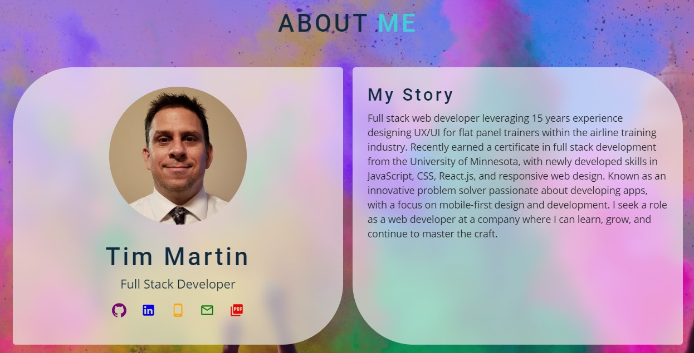

# Tim Martin Portfolio (React)

[](https://opensource.org/licenses/MIT)


## Description

My portfolio, written in React.


## Table of Contents
  
  * [Installation](#installation)
  * [Testing](#testing)
  * [Useage](#useage)
  * [Technologies](#technologies)
  * [License](#license)
  * [Contact](#contact)
  * [Links](#links)


## Installation

'git clone' from [my repository](https://github.com/TimMartin13/react-portfolio) and then open the terminal window and navigate to the folder that holds the App.js file. Run

```
npm i
```
to install the all of the dependancies.

## Testing

Vigorously, manually tested.


## Useage
The easy way: click on the Deployed link in the Links section of this document, then click one of the links in the top right to scroll to the section you would like:


If you click 'About', you will scroll down to the About Me section, in which I incorporated the latest trend in design, glassmorphism:



If you click 'Projects', you will scroll down to the Projects section, which shows my latest and greatest projects, also using glassmorphism:


Each project has a description, a list of technologies used, a link to the repository, and a link to the site it is deployed at:


## Technologies

React, JavaScript, Node.js , HTML, CSS, Material-UI


## License

Licensed under the [MIT](https://choosealicense.com/licenses/mit/) license 


## Contact

Email: timmartin13@gmail.com

Github: [TimMartin13](https://github.com/TimMartin13)


## Links

Deployed link: https://timmartin13.github.io/react-portfolio/

Repository link: https://github.com/TimMartin13/react-portfolio